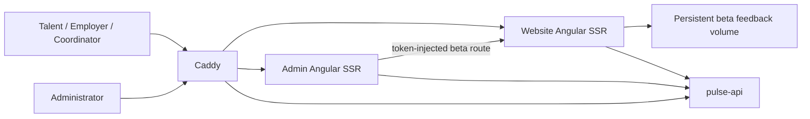

# Week 8 MVP and Future Roadmap

## Final MVP definition

DigiPulse MVP is a bilingual, theme-adaptive Angular SSR system that connects four core modules through shared identity and route context:

1. **Talent Profiles:** authenticated users can inspect the backend-owned profile and skills contract.
2. **AI Matching:** talent can request and understand explainable recommendations, including evidence and growth gaps.
3. **Messaging:** participants can load conversations, inspect message history, and send contextual messages.
4. **Admin Analytics:** administrators can inspect backend-supported totals and see honest states for unavailable datasets.

The MVP also includes a protected beta feedback loop, production container topology, readiness probes, EN/FR copy, light/dark presentation, automated quality gates, and a documented acceptance protocol.

## MVP non-goals

- Do not synthesize analytics, profile fields, participant metadata, or AI scores absent from `pulse-api`.
- Do not claim real-time messaging until a WebSocket or event-stream contract exists.
- Do not treat the JSON beta feedback store as the long-term system of record.
- Do not expose Admin feedback operations without proxy authentication.
- Do not publish user feedback or contact information as campaign evidence.

## Production candidate architecture

## Release candidate criteria

- Website and Admin unit tests pass.
- ESLint and strict TypeScript checks pass without source mutation.
- Both production SSR bundles compile within configured budgets.
- Runtime smoke validates readiness, SSR rendering, static assets, persistence, and Admin isolation.
- Core journeys have no critical unresolved defect.
- Deployment secrets and domains are replaced from their local defaults.
- A rollback owner, release owner, and monitoring window are assigned.

## Scaling roadmap

### Phase 1: Backend contract completion

- Add role-authorized Talent Profile lookup by profile ID.
- Add participant summary DTOs for names, roles, and avatars.
- Add analytics series, program oversight, reporting, and export endpoints.
- Move beta feedback into the main database with audit history and RBAC.
- Publish OpenAPI schemas and generate typed frontend clients.

### Phase 2: Collaboration and intelligence

- Add WebSocket or server-sent event delivery, presence, typing indicators, and delivery receipts.
- Add recommendation refresh/version history and calibrated confidence semantics.
- Convert skill gaps into backend-owned quest recommendations and measurable learning outcomes.
- Add notification preferences and cross-module activity events.

### Phase 3: Reliability and governance

- Add centralized logs, metrics, traces, error reporting, and SLO dashboards.
- Add database backup/restore drills, retention rules, and privacy deletion workflows.
- Add rate limits, abuse controls, security scanning, dependency updates, and penetration testing.
- Add accessibility audits against WCAG 2.2 AA and browser/device regression coverage.

### Phase 4: Program scale

- Introduce multi-program tenancy, scoped administration, cohort comparison, and configurable workflows.
- Add data warehouse exports and privacy-preserving outcome analytics.
- Add feature flags and controlled experiments tied to explicit success metrics.
- Localize beyond EN/FR only after content ownership and translation QA are established.

## Prioritized next development steps

| Priority | Next step                                                     | Owner dependency     | Exit condition                                                             |
| -------- | ------------------------------------------------------------- | -------------------- | -------------------------------------------------------------------------- |
| P0       | Complete missing profile, participant, and analytics DTOs     | Backend              | Frontend no longer needs unavailable/generic states for supported journeys |
| P0       | Replace beta token with application RBAC and database storage | Backend and security | Feedback access is authorized and audited per user                         |
| P1       | Generate API client from OpenAPI                              | Full stack           | Contract drift fails CI before merge                                       |
| P1       | Add browser E2E and accessibility automation                  | Frontend and QA      | Critical journeys run on desktop and mobile CI profiles                    |
| P1       | Add observability and alert ownership                         | DevOps               | Release health is measurable during the launch window                      |
| P2       | Add real-time collaboration transport                         | Backend and frontend | Message updates arrive without polling                                     |
| P2       | Add calibrated recommendation evaluation                      | AI and data          | Match quality is measured against an agreed benchmark                      |

## Decision log for future teams

- Keep API DTOs at the data-access boundary and map them into UI-facing interfaces.
- Keep NgRx Signal Stores responsible for asynchronous state, errors, and selection.
- Keep `ui` components store-independent and reusable.
- Prefer explicit unavailable states over fabricated fallback data.
- Require light/dark and EN/FR support for every new user-facing control.
- Extend `pnpm verify` whenever a new runtime dependency or critical journey is introduced.
